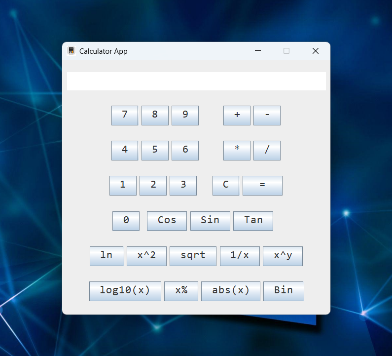

# Java_Calculator_app

# Java_Calculator_app

---

This Java Calculator App is created using java ,swing and Vscode.

---

This project was **originally written using `VsCode`**.

## : Example

## You can check in :

**[My Java Calculator App ](https://github.com/abhishek-203/Java_Calculator_app).**

## 📮 Contact

Abhisek Tiwari :
Gmail id : tiwariabhi2031@gmail.com

## ⚖️ License

Apache License, Version 2.0 or later; Read **[LICENSE](./LICENSE)** for further details.
